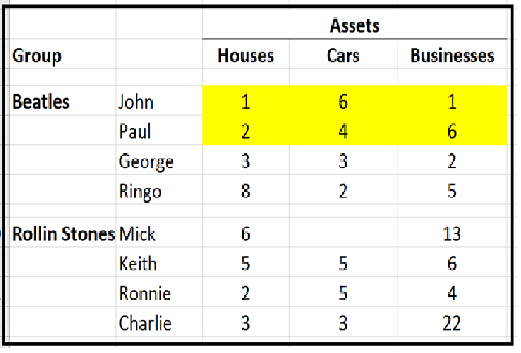
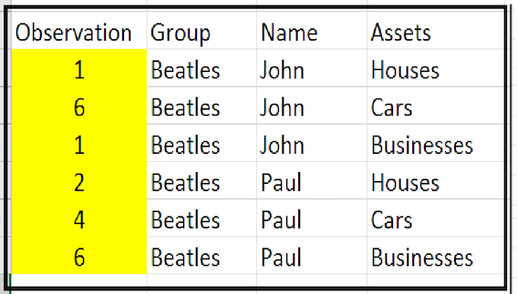

# CSVW Maturity Levels

The following document is walkthrough of using csvw and the maturity levels of it's adoption. This guide is broken down into two principle section:

1.) A walkthrough of the different levels of maturity you can reach while using csvw.

2.) Optional supplementary material that will be referenced from the main text at appropriate places. 

- [CSVW Maturity Levels](#csvw-maturity-levels)
  - [Level 0: Tidy CSV with no JSON](#level-0-tidy-csv-with-no-json)
  - [Level 1: The addition of dataset metadata as JSON](#level-1-the-addition-of-dataset-metadata-as-json)
  - [Level 2: The addition of a table schema](#level-2-the-addition-of-a-table-schema)
  - [Level 3: The addition of external tables, foreign keys and primary keys](#level-3-the-addition-of-external-tables-foreign-keys-and-primary-keys)
  - [Level 4: The addition of the transform definition](#level-4-the-addition-of-the-transform-definition)
    - [Defining Properties and Values](#defining-properties-and-values)
      - [Defining a `propertyUrl`](#defining-a-propertyurl)
      - [Defining a `valueURL`](#defining-a-valueurl)
    - [The `aboutUrl`](#the-abouturl)
  - [Level 5: The addition of a dataset structure definition.](#level-5-the-addition-of-a-dataset-structure-definition)
- [Supplementary](#supplementary)
  - [Tooling](#tooling)
    - [Validation vis csvlint](#validation-vis-csvlint)
  - [CSVW Fully 5* Open Data Compliant Example](#csvw-fully-5-open-data-compliant-example)
  - [Join The Conversation](#join-the-conversation)


## Level 0: Tidy CSV with no JSON

A "tidy" csv is a version of data that has been rendered flat and into a a-one-observation per line form.

So this untidy data...



Looks like this as a tidy data



While this doesn't provide supporting metadata, it does make the dataset easily digestible by machines and should be considered a crucial initial step.


## Level 1: The addition of dataset metadata as JSON

For ease of use, csvw uses a system of known prefixes to define fields without cluttering files with endless url references.

To make us of this pre-defined context you include the `@context` key in your csvw file, example:

```json
"@context": [
          "http://www.w3.org/ns/csvw",
          {
          "@language": "en"
          }
      ],
}
```

The csvw spec makes use of (and imports the prefixes for) several pertinent vocabularies as shown below:


| Prefix | Namespace | Description |
| ------------- | ------------- | ------------- |
| csvw:  | [http://www.w3.org/ns/csvw#](http://www.w3.org/ns/csvw#) | The principle csvw vocabulary, provides the requried definitions to define a data table.
| rdf:  | [http://www.w3.org/1999/02/22-rdf-syntax-ns#](http://www.w3.org/1999/02/22-rdf-syntax-ns#) | The RDF Schema.
| rdfs: | [http://www.w3.org/2000/01/rdf-schema#](http://www.w3.org/2000/01/rdf-schema#) | The RDF vocabulary (which makes use of the schema - see above)
| xsd: | [http://www.w3.org/2001/XMLSchema#](http://www.w3.org/2001/XMLSchema#) | The XML Schema namespace
| dc: | [http://purl.org/dc/terms/](http://purl.org/dc/terms/) | Specification of all metadata terms maintained by the Dublin Core Metadata Initiative. Includes an extensive metadata vocabulary.
| dcat: | [http://www.w3.org/ns/dcat#](http://www.w3.org/ns/dcat#) | The Data Catalogue vocabulary.
| prov: | [http://www.w3.org/ns/prov#](http://www.w3.org/ns/prov#) | Supports the interchange of provenance on the web.

This use of these prefixes allows you to easily express semantically defined metadata via your json file, for example:

```json
{
  "dc:title": "Trade in goods",
  "dc:issued": {
      "@value": "2020-04-08",
      "@type": "http://www.w3.org/2001/XMLSchema#date"
    },
}
```

Allows you to express the title, the data issued (and the schema the date is using) in a relatively terse way.

eg `dc:title` resolves to [http://purl.org/dc/terms/title](http://purl.org/dc/terms/title) which will lead you to a specific (and public) definition of the exact meaning of the word `title` in this context.

The following is more extensive example of using csvw to capture metadata about a dataset (please note - the `url` field is just indicating the location of the csv table being defined - in this case "observations.csv" and in the same location).

```json

{
  "@context": [
    "http://www.w3.org/ns/csvw",
    {
      "@language": "en"
    }
  ],
  "tables": [
    {
      "url": "observations.csv"
    }
  ],
  "@id": "http://gss-data.org.uk/data/gss_data/trade/ons-trade-in-goods#tablegroup",
  "prov:hadDerivation": {
    "@id": "http://gss-data.org.uk/data/gss_data/trade/ons-trade-in-goods",
    "@type": "dcat:Dataset",
    "dc:publisher": {
      "@id": "https://www.gov.uk/government/organisations/office-for-national-statistics"
    },
    "dc:title": "Trade in goods: country-by-commodity imports and exports",
    "dcat:landingPage": {
      "@id": "https://www.ons.gov.uk/economy/nationalaccounts/balanceofpayments/datasets/uktradecountrybycommodityimports"
    },
    "rdfs:label": "Trade in goods: country-by-commodity imports and exports",
    "dc:creator": {
      "@id": "https://www.gov.uk/government/organisations/office-for-national-statistics"
    },
    "dc:issued": {
      "@value": "2020-04-08",
      "@type": "http://www.w3.org/2001/XMLSchema#date"
    },
    "dc:license": {
      "@id": "http://www.nationalarchives.gov.uk/doc/open-government-licence/version/3/"
    },
    "dc:modified": {
      "@value": "2020-04-17T15:09:09.835868+00:00",
      "@type": "http://www.w3.org/2001/XMLSchema#dateTime"
    },
    "dc:description": {
      "@value": "Monthly import country-by-commodity data on the UK's trade in goods, including trade by all countries and selected commodities, non-seasonally adjusted.",
      "@type": "https://www.w3.org/ns/iana/media-types/text/markdown#Resource"
    },
    "dcat:contactPoint": {
      "@id": "mailto:trade@ons.gov.uk"
    },
    "dcat:theme": {
      "@id": "http://gss-data.org.uk/def/concept/statistics-authority-themes/business-industry-trade-energy"
    },
    "rdfs:comment": "Monthly import and export country-by-commodity data on the UK's trade in goods, including trade by all countries and selected commodities, non-seasonally adjusted.",
    "void:sparqlEndpoint": {
      "@id": "http://gss-data.org.uk/sparql"
    }
  }
}
```

As a general point its worth remembering that _any_ semantically defined metadata is a step forward and that any json metadata schema can easily be expanded upon (i.e the above is an example goal, not necesserily where you'd need to start).

## Level 2: The addition of a table schema 

By using the csvw context we get access to defined classes that can be used to fully describe a csv file. You can view these classes at [https://www.w3.org/ns/csvw#class-definitions](https://www.w3.org/ns/csvw#class-definitions).

Example: For a given csvw file

- The schema references 1 or more `tables` as an array of type `table`.
- Each `table` has a `tableSchema`
- Each `tableSchema` has `columns` as an array of `column`
- Each `column` is represented by a hashmap of one or more fields (themselves defined classes used to describe the properties of individual columns), eg `titles`, `required`, `name` etc

It's important to understand a rule of csvw here - all fields in a csvw json file should be one of:

- a plain field defined within the csvw vocabulary (this examples)
- a prefixed field referencing one of the included supplementary vocabularies (as described for maturity level 1).

The following is a snippet that uses the former to describe a table schema.

```json
"tableSchema": {
  "columns": [
  {
    "titles": "Sex",
    "required": true,
    "name": "sex",
    "datatype": {
       "format": "^(M|F)$"
          }
   },
   {
     "titles": "Age",
     "required": true,
     "name": "age",
     "datatype": "string"
   }]
  }
```

You'll notice this snippet includes a datatype field, this is a simple mechanism for providing basic data validation.

This includes pattern matching (i.e `"^(M|F)$"`) using regular expressions (more information on these can be found at https://blog.usejournal.com/regular-expressions-a-complete-beginners-tutorial-c7327b9fd8eb) and a simple statment of the "age" columna as type `string`.

Both can be used to validate the provided contents of the columns in question (for more information on how you can implement said validation, please see the included supplementary section on csvw tooling).

Please note - in this example the distinction between the name and title fields seem somewhat redundant (which is fair - in a deliberately simple example) but be aware that they serve as effectively the label (title) and identifer (name) so it's a destinction that becomes increasingly important for more complex scenarios where they won't necessarily be the same.

-----

## Level 3: The addition of external tables, foreign keys and primary keys

Csvw allows for a single csvw.json file to define more than one data table. This is to permit clear linkage to external data sources.

For example, lets extend the previous example to hold information about codelists that define the columns within our principle csv.

```json
"tables": [
{
  "url": "http://gss-data.org.uk/codelists/sex.csv",
  "tableSchema": "https://gss-cogs.github.io/ref_common/codelist-schema.json",
},
{
  "url": "http://gss-data.org.uk/codelists/age.csv",
  "tableSchema": "https://gss-cogs.github.io/ref_common/codelist-schema.json",
},
{
  "url":"my-example.csv",
  "tableSchema": {
      "columns": [
      {
        "titles": "Sex",
        "required": true,
        "name": "sex",
        "datatype": {
           "format": "^(M|F)$"
              }
       },
       {
         "titles": "Age",
         "required": true,
         "name": "age",
         "datatype": "string"
       }]
    },
  "primaryKey": [
      "age",
      "sex"
    ]
}
```

You'll notice that I've include one of the `url` references as `my-example.csv`, the lack of a full path is because **that is the csv file that this csvw schema is accompanying**. It's also worth noting that the tableSchema entries can themsevles be remote resources and can be freely reused where appropriate.

Then there is the `primaryKey` field. One crucial requirement of tidy data is that **each oberserable data point should be uniquely identifiable**. The job of the primary key is to list the dimensional options that make each observation unique. In other words - the `primaryKey` field in our example is specifiying that **a composite key of the values within the "age and "sex" columns will identify one (and only one) observable data point**.


Lastly, we need to establish the link between the referenced codelst csvs and the principle csv (i.e "my-example.csv") that we're describing. We do this via the declaration of `Foreign Keys`.

The definition of `Foreign Keys` as provided by [https://www.w3.org/ns/csvw](https://www.w3.org/ns/csvw) is "*Describes relationships between Columns in one or more Tables*."

Consider the following example:

```json
"foreignKeys": [
{
  "columnReference": "age",
  "reference": {
    "resource": "http://gss-data.org.uk/codelists/age.csv",
    "columnReference": "notation"
  }
}]
```

This is telling us the following:
- we're importing the `resource` age.csv
- The `Age` column of our observation file (denoted by the above `columnReference` field referencing `age` - the `name` field we defined for that column earlier) ...
- Is mapped to the `notation` column of  abother resource (as denoted by the **indented** `columnReference` field).

If you're unsure where `notation` came from, it's in the tableSchema we provided when we defined the codelist tables, see here: [https://gss-cogs.github.io/ref_common/codelist-schema.json](https://gss-cogs.github.io/ref_common/codelist-schema.json)

So when you put it all together ...

```json
{
"@context": [
          "http://www.w3.org/ns/csvw",
          {
          "@language": "en"
          }
      ],
"tables": [
{
  "url": "http://gss-data.org.uk/codelists/sex.csv",
  "tableSchema": "https://gss-cogs.github.io/ref_common/codelist-schema.json",
},
{
  "url": "http://gss-data.org.uk/codelists/age.csv",
  "tableSchema": "https://gss-cogs.github.io/ref_common/codelist-schema.json",
},
{
  "url":"my-example.csv",
  "tableSchema": {
      "columns": [
      {
        "titles": "Sex",
        "required": true,
        "name": "sex",
        "datatype": {
           "format": "^(M|F)$"
              }
       },
       {
         "titles": "Age",
         "required": true,
         "name": "age",
         "datatype": "string"
       }]
    }
},
{
"foreignKeys": [
  {
  "columnReference": "age",
  "reference": {
    "resource": "http://gss-data.org.uk/codelists/age.csv",
    "columnReference": "notation"
    },
  }
  {
  "columnReference": "sex",
  "reference": {
    "resource": "http://gss-data.org.uk/codelists/sex.csv",
    "columnReference": "notation"
      }
  }
],
"primaryKey": [
      "age",
      "sex"
    ]
}
```

You get an english language schema fully describing the columns of a machine readable csv (with the potential for basic data validation) as well as links to both the data and schema of associated csv files representing the codes and codelists in use.

-----

## Level 4: The addition of the transform definition

We'll start with how to incorporate concept definitions in your csvw schemas.

If you think back to example one, we had the field `title` being imported via the csvw context, this property is representing `https://www.dublincore.org/specifications/dublin-core/dcmi-terms#title` and that definition is provided by the csvw context, so that field *already has* a fully semantically described definition (as do all class and properties taken from the csvw vocabulary).

The principle task therefore is to provide semantic meaning for any data you are including *that has not already described by the csvw vocabulary*. In practice this will just be the definitons of the data concepts and codes in use.

Let's look at a column definition from the earlier examples that's has been extended with additional concept information.

```json
{
  "titles": "Age",
  "required": true,
  "name": "age",
  "datatype": "string",
  "propertyUrl": "http://purl.org/linked-data/sdmx/2009/dimension#age",
  "valueUrl": "http://gss-data.org.uk/def/concept/age/{age}"
},
```

The `propertyUrl` can broadly be thought of as the concept list or dimension this column is describing.

The `valueUrl` provides definitions of the concepts or dimension-items that reside within these them.

The formatting of the `valueUrl` in our example, eg `/age/{age}` is representing all the values within the age column. So for every given unique value in the age column its effectively referencing a url of `http://gss-data.org.uk/def/concept/age/{whichever value from the age column we're talking about}`.

Note - you'll see we're using a common SDMX dimension for the age concept and switching to our own specific resource for the ages within it. This is a typical approach for extending the linkage between datasets (not many datasets will use our exact age ranges and definitions - but most people can agree on what the general concept of "age" means).

Despite the example, you can also supply home grown `propertyUrls` as well should you be tackling a more niche concept, a concept not described elsewhere or where your using a different definition than peer organisations.

In other words ...

```json
{
  "titles": "Age",
  "required": true,
  "name": "age",
  "datatype": "string",
  "propertyUrl": "http://gss-data.org.uk/def/concept/age",
  "valueUrl": "http://gss-data.org.uk/def/concept/age/{age}"
},
```
Is also a perfectly valid definition, abeit one with less linkage (as we're using a home-grown property).

Note - it's both valid and fairly common to start with home-grown definitons of everything (much like the `gss-data.org.uk` namespace we're using in the examples) and work on harmonising your data references later, once you know what you want to use it's ultimately changing a value in a  single field.

### Defining Properties and Values

So the next question is, what exactly are the `propertyUrl` and `valueUrls` that we've started including in the previous stage?

#### Defining a `propertyUrl`

In the context of a column of data, the property (as identified bythe propertyURL) encapsulates several pieces of information:

- the concept being represented (e.g. time or geographic area),
- the nature of the component (dimension, attribute or measure) as represented by the type of the component property,
- the type or code list used to represent the value.

So the next step will be capturing this information and making it availible at the provided urls.

`Property Example 1`: the generic SDMX property definition for age we referenced previously can be seen here: [http://purl.org/linked-data/sdmx/2009/dimension#age](http://purl.org/linked-data/sdmx/2009/dimension#age) and is very much a simple dump of basic SDMX attriutes written in an RDF form (that nonetheless provides the three principle pieces of information listed above).

You'll notice this page also covers a number of concepts at a very basic level, this form of multi-definition resource is perfectly valid.

`Property Example 2`: a property definition taken from an RDF centric data platform can be seen here [](). This is more in depth and extends the base information in a way that adds value for users (it provides more information that could be used to cross-query datasets).

Either will work, with the exact implementation being subject to individual use cases and resource.

For a much more detailed look into properties and how they (will eventually) help inform the data structure definition of a semantically defined dataset please see: [https://www.w3.org/TR/vocab-data-cube/#dsd](https://www.w3.org/TR/vocab-data-cube/#dsd)


#### Defining a `valueURL`

One the surface of it the `valueURL` seems like it'd be a more specfic defintion as its tied to a specific concept within a concept list - but - it's important to remember the aim here is slightly different. We already have a property definition, so the primary goal is in making values distinguishable rather than providing a fine grained definition (to be clear that does add value and is worth pursuing where possible, but it's definetly a secondary goal).

Smply put - in the majority of scenarios simply having a namespace for each value will be sufficiant at this stage. So even if the namespace for the value eg `/age/{17}` simpley says `17` that's perfectly fine (again the `valueURL` is more concerned with value **identification** than **definition**).

### The `aboutUrl`

As defined by [https://www.w3.org/ns/csvw](https://www.w3.org/ns/csvw) the `aboutUrl` is **A URI template property that MAY be used to indicate what a cell contains information about**.

In practice, for a tidy csv it's equivilent to a unique identifier for any given observation in the dataset.

So given our example of a dataset with dimensions of `Age` and `Sex` it would be:

`http://the-url-that-uniquely-identifiers-my-dataset/{age}/{sex}`

And will always include one argument (eg `/{age}`) for each non-observational column within the csv.

## Level 5: The addition of a dataset structure definition.

So at this point we have a csvw schema that fully describes the concepts and codelists it's referencing, so that last thing to accomplish is to provide a full dataset structure defintion.

Please note - the addition of a dsd is the last step is creating a fulll semantically supplied definition. Once this step is implemented you will have all the information required to convert the csv directly to RDF linked data should you need to (i.e your csv + csvw outputs will be functionally equivelant to RDF outputs).

The principle thing to understand here, other than explicitly stating a few things a human could just infer from the earlier examples is **we're only actually adding a very small amount of additional information** in the form of defining the components of our dataset.

There are effectively three types of component that make up a data cube, as follows:

| Component | Description
| ------------- | ------------- 
| Dimension | The dimension components serve to identify the observations. A set of values for all the dimension components is sufficient to identify a single observation. Examples of dimensions include the time to which the observation applies, or a geographic region which the observation covers.
| Measure | The measure components represent the phenomenon being observed.
| Attribute | The attribute components allow us to qualify and interpret the observed value(s). They enable specification of the units of measure, any scaling factors and metadata such as the status of the observation (e.g. estimated, provisional).

Please note - these definitions are taken directly from the rdf data cube model at [https://www.w3.org/TR/vocab-data-cube/#cubes-model](https://www.w3.org/TR/vocab-data-cube/#cubes-model).

First, lets's look an example Dimension component as it appears in the dsd:

```json
{
  "@id": "http://gss-data.org.uk/sdg-example-dataset/component/age",
  "@type": "qb:ComponentSpecification",
  "qb:componentProperty": {
    "@id": "http://purl.org/linked-data/sdmx/2009/dimension#age"
  },
  "qb:dimension": {
    "@id": "http://purl.org/linked-data/sdmx/2009/dimension#age",
    "@type": "qb:DimensionProperty",
    "rdfs:label": "Age",
    "rdfs:range": {
      "@id": "http://gss-data.org.uk/def/classes/age/age"
    }
  }
}
```
In terms of what we're looking at here:

We need to declare that it is a component (the upper block). We need to declare that it is a dimension, as well as confirm it's label and give it a range (the lower block).

For attributes we follow the same pattern, simply using `qb:attribute`, `qb:AttributeProperty` in place of `qb:dimension` and `qb:DimensionProperty` repectively.

The following example has both a `Dimension` column and an `Attribute` column defined.

```json
{ 
  "qb:structure": {
      "@id": "http://gss-data.org.uk/my-example-dataset/structure",
      "@type": "qb:DataStructureDefinition",
      "qb:component": [
          {
            "@id": "http://gss-data.org.uk/sdg-example-dataset/component/age",
            "@type": "qb:ComponentSpecification",
            "qb:componentProperty": {
              "@id": "http://purl.org/linked-data/sdmx/2009/dimension#age"
                },
                "qb:dimension": {
                "@id": "http://purl.org/linked-data/sdmx/2009/dimension#age",
                "@type": "qb:DimensionProperty",
                "rdfs:label": "Age",
                "rdfs:range": {
                  "@id": "http://gss-data.org.uk/def/classes/age/age"
                  }
                }
          },
          {
            "@id": "http://gss-data.org.uk/sdg-example-dataset/component/unit_multiplier",
            "@type": "qb:ComponentSpecification",
            "qb:componentProperty": {
              "@id": "http://purl.org/linked-data/sdmx/2009/attribute#unitMult"
                },
                "qb:attribute": {
                "@id": "http://purl.org/linked-data/sdmx/2009/attribute#unitMult",
                "@type": "qb:AttributeProperty",
                "rdfs:label": "Unit multiplier",
                "rdfs:range": {
                  "@id": "http://gss-data.org.uk/def/classes/unit-multiplier/unit_multiplier"
                  }
                }
          }
      ]
  }
}
```

One key thing to be aware of is the RDF datacube specs handling of measure types.

If you specify a component dimension as `http://purl.org/linked-data/cube#measureType` then **all measures within that cube are assumed to reside within that dimension**. This allows you to include multiple measures in your dataset and differentiate them with a simple column.

The following example shows how to declare this special dimension and define one of the measures that reside within it (in this case a measure of type count).

```json
{ 
  "qb:structure": {
      "@id": "http://gss-data.org.uk/my-example-dataset/structure",
      "@type": "qb:DataStructureDefinition",
      "qb:component": [
      {
        "@id": "http://gss-data.org.uk/sdg-example-dataset/component/measure_type",
        "@type": "qb:ComponentSpecification",
        "qb:componentProperty": {
        "@id": "http://purl.org/linked-data/cube#measureType"
            },
        "qb:dimension": {
          "@id": "http://purl.org/linked-data/cube#measureType",
          "@type": "qb:DimensionProperty",
          "rdfs:label": "Measure Type",
            "rdfs:range": {
              "@id": "qb:MeasureProperty"
            }
          },
      },
      {
          "@id": "http://gss-data.org.uk/nhs-example-dataset/component/count",
          "@type": "qb:ComponentSpecification",
          "qb:componentProperty": {
            "@id": "http://gss-data.org.uk/def/measure/count"
          },
          "qb:measure": {
            "@id": "http://gss-data.org.uk/def/measure/count",
            "@type": "qb:MeasureProperty",
            "rdfs:label": "Count"
          }
      }
      ]
  }
}
```

For more information on the rdf datacube spec please see [https://www.w3.org/TR/vocab-data-cube/](https://www.w3.org/TR/vocab-data-cube/).

# Supplementary

## Tooling

### Validation vis csvlint

There are a few tools you can use to validate your csvw using these datatype entries provided by the `column` definitions (and the csvw on the whole). One example would be a tool called csvlint (more details of which can be found here: [https://github.com/Data-Liberation-Front/csvlint.rb](https://github.com/Data-Liberation-Front/csvlint.rb)).

We currently run this through a docker image for our own work via:

`docker run -v $PWD/:/workspace -w /workspace gsscogs/csvlint csvlint -s <PATH_TO_YOUR_CSVW.json>`


## CSVW Fully 5* Open Data Compliant Example

The following is a csvw file providing definitions equivilent to a 5* linked open dataset (as-in, you could generate a fully described RDF output of the data just from the csv plus this csvw).

The following has been included purely as an "end goal" example rather than anything to strive for immediately (and please note - most of the below would be provided gradually or by automation - this is **not** something a single person should ever sit down to try and create manually).

```json
{
  "@context": [
    "http://www.w3.org/ns/csvw",
    {
      "@language": "en"
    }
  ],
  "@id": "http://gss-data.org.uk/data/gss_data/trade/ons-trade-in-goods#tablegroup",
  "prov:hadDerivation": {
    "@id": "http://gss-data.org.uk/data/gss_data/trade/ons-trade-in-goods",
    "@type": "dcat:Dataset",
    "dc:publisher": {
      "@id": "https://www.gov.uk/government/organisations/office-for-national-statistics"
    },
    "dc:title": "Trade in goods: country-by-commodity imports and exports",
    "dcat:landingPage": {
      "@id": "https://www.ons.gov.uk/economy/nationalaccounts/balanceofpayments/datasets/uktradecountrybycommodityimports"
    },
    "rdfs:label": "Trade in goods: country-by-commodity imports and exports",
    "dc:creator": {
      "@id": "https://www.gov.uk/government/organisations/office-for-national-statistics"
    },
    "dc:issued": {
      "@value": "2020-04-08",
      "@type": "http://www.w3.org/2001/XMLSchema#date"
    },
    "dc:license": {
      "@id": "http://www.nationalarchives.gov.uk/doc/open-government-licence/version/3/"
    },
    "dc:modified": {
      "@value": "2020-04-17T15:09:09.835868+00:00",
      "@type": "http://www.w3.org/2001/XMLSchema#dateTime"
    },
    "dc:description": {
      "@value": "Monthly import country-by-commodity data on the UK's trade in goods, including trade by all countries and selected commodities, non-seasonally adjusted.",
      "@type": "https://www.w3.org/ns/iana/media-types/text/markdown#Resource"
    },
    "dcat:contactPoint": {
      "@id": "mailto:trade@ons.gov.uk"
    },
    "dcat:theme": {
      "@id": "http://gss-data.org.uk/def/concept/statistics-authority-themes/business-industry-trade-energy"
    },
    "rdfs:comment": "Monthly import and export country-by-commodity data on the UK's trade in goods, including trade by all countries and selected commodities, non-seasonally adjusted.",
    "void:sparqlEndpoint": {
      "@id": "http://gss-data.org.uk/sparql"
    }
  },
  "tables": [
    {
      "url": "http://gss-data.org.uk/codelists/period.csv",
      "tableSchema": "https://gss-cogs.github.io/ref_common/codelist-schema.json",
      "suppressOutput": true
    },
    {
      "url": "http://gss-data.org.uk/codelists/period.csv",
      "tableSchema": "https://gss-cogs.github.io/ref_common/codelist-schema.json",
      "suppressOutput": true
    },
    {
      "url": "http://gss-data.org.uk/codelists/org-code.csv",
      "tableSchema": "https://gss-cogs.github.io/ref_common/codelist-schema.json",
      "suppressOutput": true
    },
    {
      "url": "http://gss-data.org.uk/codelists/sex.csv",
      "tableSchema": "https://gss-cogs.github.io/ref_common/codelist-schema.json",
      "suppressOutput": true
    },
    {
      "url": "http://gss-data.org.uk/codelists/age.csv",
      "tableSchema": "https://gss-cogs.github.io/ref_common/codelist-schema.json",
      "suppressOutput": true
    },
    {
      "url": "observations.csv",
      "tableSchema": {
        "columns": [
          {
            "titles": "Period",
            "required": true,
            "name": "period",
            "datatype": {
              "format": "^(year/[0-9]{4}|gregorian-interval/.*|month/[0-9]{4}-[0-9]{2}|day/[0-9]{4}-[0-9]{2}-[0-9]{2}|quarter/[0-9]{4}-Q[1-4]|government-year/[0-9]{4}-[0-9]{4})$"
            },
            "propertyUrl": "http://purl.org/linked-data/sdmx/2009/dimension#refPeriod",
            "valueUrl": "http://reference.data.gov.uk/id/{+period}"
          },
          {
            "titles": "Area",
            "required": true,
            "name": "area",
            "datatype": "string",
            "propertyUrl": "http://purl.org/linked-data/sdmx/2009/dimension#refArea",
            "valueUrl": "http://statistics.data.gov.uk/id/statistical-geography/{area}"
          },
          {
            "titles": "Org Code",
            "required": true,
            "name": "org_code",
            "datatype": "string",
            "propertyUrl": "http://gss-data.org.uk/def/dimension/org_code",
            "valueUrl": "http://gss-data.org.uk/def/concept/org-code/{org_code}"
          },
          {
            "titles": "Sex",
            "required": true,
            "name": "sex",
            "datatype": {
              "format": "^(M|F|T)$"
            },
            "propertyUrl": "http://purl.org/linked-data/sdmx/2009/dimension#sex",
            "valueUrl": "http://purl.org/linked-data/sdmx/2009/code#sex-{sex}"
          },
          {
            "titles": "Age",
            "required": true,
            "name": "age",
            "datatype": "string",
            "propertyUrl": "http://purl.org/linked-data/sdmx/2009/dimension#age",
            "valueUrl": "http://gss-data.org.uk/def/concept/ages/{age}"
          },
          {
            "titles": "Value",
            "required": false,
            "name": "value",
            "datatype": "number",
            "propertyUrl": "http://gss-data.org.uk/def/measure/{measure_type}"
          },
          {
            "titles": "Measure Type",
            "required": true,
            "name": "measure_type",
            "datatype": "string",
            "propertyUrl": "http://purl.org/linked-data/cube#measureType",
            "valueUrl": "http://gss-data.org.uk/def/measure/{measure_type}"
          },
          {
            "name": "dataset_ref",
            "virtual": true,
            "propertyUrl": "qb:dataSet",
            "valueUrl": "http://gss-data.org.uk/nhs-example-dataset"
          },
          {
            "name": "qbtype",
            "virtual": true,
            "propertyUrl": "rdf:type",
            "valueUrl": "qb:Observation"
          }
        ],
        "foreignKeys": [
          {
            "columnReference": "period",
            "reference": {
              "resource": "http://gss-data.org.uk/codelists/period.csv",
              "columnReference": "notation"
            }
          },
          {
            "columnReference": "area",
            "reference": {
              "resource": "http://gss-data.org.uk/codelists/period.csv",
              "columnReference": "notation"
            }
          },
          {
            "columnReference": "org_code",
            "reference": {
              "resource": "http://gss-data.org.uk/codelists/org-code.csv",
              "columnReference": "notation"
            }
          },
          {
            "columnReference": "sex",
            "reference": {
              "resource": "http://gss-data.org.uk/codelists/sex.csv",
              "columnReference": "notation"
            }
          },
          {
            "columnReference": "age",
            "reference": {
              "resource": "http://gss-data.org.uk/codelists/age.csv",
              "columnReference": "notation"
            }
          }
        ],
        "primaryKey": [
          "period",
          "area",
          "org_code",
          "sex",
          "age",
          "measure_type"
        ],
        "aboutUrl": "http://gss-data.org.uk/gss-data.org.uk/nhs-example-dataset/{period}/{area}/{org_code}/{sex}/{age}/{measure_type}"
      }
    }
  ],
  "@id": "http://gss-data.org.uk/nhs-example-dataset#tablegroup",
  "prov:hadDerivation": {
    "@id": "http://gss-data.org.uk/nhs-example-dataset",
    "@type": [
      "qb:DataSet"
    ],
    "qb:structure": {
      "@id": "http://gss-data.org.uk/nhs-example-dataset/structure",
      "@type": "qb:DataStructureDefinition",
      "qb:component": [
        {
          "@id": "http://gss-data.org.uk/nhs-example-dataset/component/period",
          "@type": "qb:ComponentSpecification",
          "qb:componentProperty": {
            "@id": "http://purl.org/linked-data/sdmx/2009/dimension#refPeriod"
          },
          "qb:dimension": {
            "@id": "http://purl.org/linked-data/sdmx/2009/dimension#refPeriod",
            "@type": "qb:DimensionProperty",
            "rdfs:label": "Period",
            "rdfs:range": {
              "@id": "http://reference.data.gov.uk/def/intervals/Interval"
            }
          }
        },
        {
          "@id": "http://gss-data.org.uk/nhs-example-dataset/component/area",
          "@type": "qb:ComponentSpecification",
          "qb:componentProperty": {
            "@id": "http://purl.org/linked-data/sdmx/2009/dimension#refArea"
          },
          "qb:dimension": {
            "@id": "http://purl.org/linked-data/sdmx/2009/dimension#refArea",
            "@type": "qb:DimensionProperty",
            "rdfs:label": "Area"
          }
        },
        {
          "@id": "http://gss-data.org.uk/nhs-example-dataset/component/org_code",
          "@type": "qb:ComponentSpecification",
          "qb:componentProperty": {
            "@id": "http://gss-data.org.uk/def/dimension/org_code"
          },
          "qb:dimension": {
            "@id": "http://gss-data.org.uk/def/dimension/org_code",
            "@type": "qb:DimensionProperty",
            "rdfs:label": "Org Code",
            "rdfs:range": {
              "@id": "http://gss-data.org.uk/def/classes/org-code/org-code"
            }
          }
        },
        {
          "@id": "http://gss-data.org.uk/nhs-example-dataset/component/sex",
          "@type": "qb:ComponentSpecification",
          "qb:componentProperty": {
            "@id": "http://purl.org/linked-data/sdmx/2009/dimension#sex"
          },
          "qb:dimension": {
            "@id": "http://purl.org/linked-data/sdmx/2009/dimension#sex",
            "@type": "qb:DimensionProperty",
            "rdfs:label": "Sex",
            "rdfs:range": {
              "@id": "http://purl.org/linked-data/sdmx/2009/code#Sex"
            }
          }
        },
        {
          "@id": "http://gss-data.org.uk/nhs-example-dataset/component/age",
          "@type": "qb:ComponentSpecification",
          "qb:componentProperty": {
            "@id": "http://purl.org/linked-data/sdmx/2009/dimension#age"
          },
          "qb:dimension": {
            "@id": "http://purl.org/linked-data/sdmx/2009/dimension#age",
            "@type": "qb:DimensionProperty",
            "rdfs:label": "Age"
          }
        },
        {
          "@id": "http://gss-data.org.uk/nhs-example-dataset/component/measure_type",
          "@type": "qb:ComponentSpecification",
          "qb:componentProperty": {
            "@id": "http://purl.org/linked-data/cube#measureType"
          },
          "qb:dimension": {
            "@id": "http://purl.org/linked-data/cube#measureType",
            "@type": "qb:DimensionProperty",
            "rdfs:label": "Measure Type",
            "rdfs:range": {
              "@id": "qb:MeasureProperty"
            }
          }
        },
        {
          "@id": "http://gss-data.org.uk/nhs-example-dataset/component/count",
          "@type": "qb:ComponentSpecification",
          "qb:componentProperty": {
            "@id": "http://gss-data.org.uk/def/measure/count"
          },
          "qb:measure": {
            "@id": "http://gss-data.org.uk/def/measure/count",
            "@type": "qb:MeasureProperty",
            "rdfs:label": "Count"
          }
        }
      ]
    }
  }
}
```
## Join The Conversation

This resource was created by the COGS (**C**onnected **O**pen **G**overnment **S**tatistics) project, the stated goal of which is:

```
Revolutionising how UK Government Statistical Data is made available on the Web by creating a repository of 5* Linked Open Data Statistics.
```

This will not be done easily, nor can it be done in isolation, as such the "Connected" in COGS is as much about connecting people and organisations as it is about connecting data (nobody is climbing this mountain alone).

As such we are always actively looking for partners in our joint mission, and new voices to join the conversation around linked open data statistics and the future of government statistics.

So please do get in touch via `darren.barnes@gsscogs.uk`.